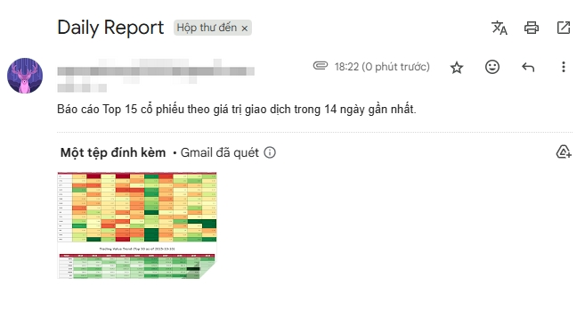

# 🧭 HOSE Money Flow Tracking

**Idea:**  
Based on daily trading data from HOSE, this project aims to identify and visualize **money flow trends** across the market.

---

## 📊 Data Source
- API connected to **Google Drive**
- Daily upload of HOSE statistics from **Vietstock** (via mobile)
- Processing and calculation performed using **Python on GitHub**

---

## ⚙️ Results
- Automatically sends a **daily report** on investment flow movement  
- Initially includes **three key charts** per report  
- Will be expanded later to explore deeper insights

---

## 📈 Example Dashboard

  

  

---

## 🚀 Future Enhancements
- Add interactive charts
- Support long-term trend comparison
- Improve automation and scheduling
